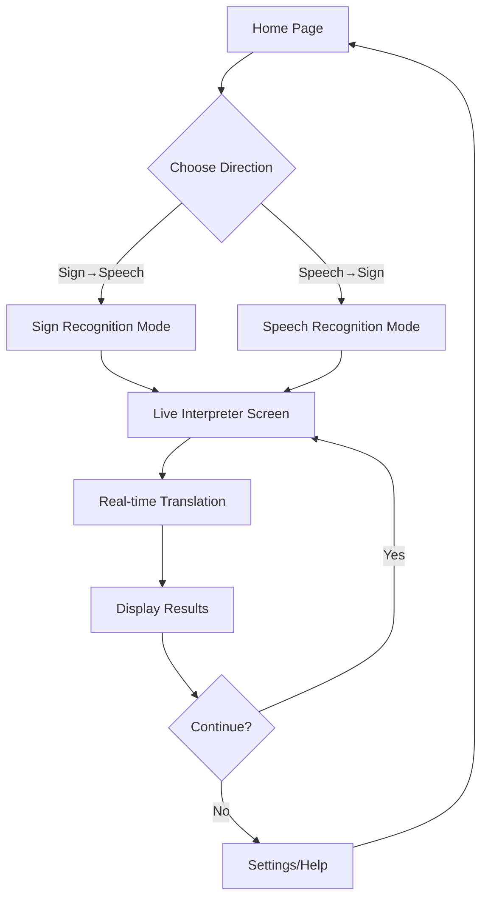

## 1. Product Overview
Real-time bidirectional Sign Language ↔ Speech Interpreter for Ghana Sign Language (GSL). Enables seamless communication between deaf/hard-of-hearing and hearing communities through AI-powered translation.

Breaks communication barriers for Ghana's deaf community by providing accurate, culturally-appropriate GSL translation with <500ms latency. Designed for non-technical users with accessibility-first approach.

## 2. Core Features

### 2.1 User Roles
| Role | Registration Method | Core Permissions |
|------|---------------------|------------------|
| Deaf User | No registration required | Full access to sign→speech features |
| Hearing User | No registration required | Full access to speech→sign features |
| Admin | Secure admin portal | Dictionary management, system monitoring |

### 2.2 Feature Module
Our GSL interpreter consists of the following main pages:
1. **Home page**: Direction selection (Sign→Speech / Speech→Sign), quick start buttons, accessibility options
2. **Live Interpreter Screen**: Real-time video/audio capture, translation display, confidence indicators, visual feedback
3. **Settings page**: Avatar preferences, speed controls, language options, accessibility settings
4. **Help/Tutorial**: Visual guides, gesture examples, troubleshooting assistance

### 2.3 Page Details
| Page Name | Module Name | Feature description |
|-----------|-------------|---------------------|
| Home page | Direction Selection | Toggle between sign-to-speech and speech-to-sign modes with large, high-contrast buttons |
| Home page | Quick Start | One-click access to most recent translation mode with visual indicators |
| Home page | Accessibility Panel | High contrast toggle, font size adjustment, visual cue preferences |
| Live Interpreter | Video Capture Module | Real-time webcam feed with hand/body/face detection overlay, visual feedback for sign recognition |
| Live Interpreter | Translation Display | Show recognized GSL glosses, English translation, confidence percentage in large, clear text |
| Live Interpreter | Audio Interface | Microphone input visualization, speech-to-text display, text-to-speech output with volume control |
| Live Interpreter | Avatar Display | 3D signing avatar or video clips with synchronized facial expressions, smooth transitions between signs |
| Settings | Avatar Preferences | Choose between 3D avatar or video-based signing, adjust avatar appearance |
| Settings | Speed Controls | Adjust signing speed (0.5x-2x), speech rate, translation processing speed |
| Settings | Language Options | English/Ghanaian accent preferences, formality levels |
| Settings | Accessibility | Color contrast themes, button sizes, visual vs audio feedback preferences |
| Help/Tutorial | Visual Guide | Step-by-step pictorial instructions for system usage |
| Help/Tutorial | Gesture Examples | Common GSL signs with video demonstrations |
| Help/Tutorial | Troubleshooting | Visual diagnostics for common issues (lighting, camera angle, audio quality) |

## 3. Core Process

**Sign → Speech Flow**: User positions themselves in camera view → System detects hands/body/face → Continuous sign recognition extracts GSL glosses → GSL grammar translated to English → Text displayed and converted to natural speech → Confidence feedback provided throughout

**Speech → Sign Flow**: User speaks into microphone → Whisper transcribes speech to text → English grammar converted to GSL structure → Translation rendered as 3D avatar animations or video clips → Facial expressions synchronized → Visual feedback confirms understanding

## 4. User Interface Design

### 4.1 Design Style
- **Primary Colors**: Deep blue (#1E3A8A) for trust, bright yellow (#F59E0B) for Ghana heritage
- **Secondary Colors**: High contrast white/black, accessibility green (#10B981) for success states
- **Button Style**: Large (min 44px), rounded corners, clear hover states, 3D press effect
- **Font**: Sans-serif, minimum 16px body text, 24px+ for headings, support for dyslexia-friendly fonts
- **Layout**: Card-based with clear visual hierarchy, generous spacing (8px grid system)
- **Icons**: Simple line icons with high contrast, include text labels, avoid cultural assumptions

### 4.2 Page Design Overview
| Page Name | Module Name | UI Elements |
|-----------|-------------|-------------|
| Home page | Direction Selection | Two large circular buttons (200px+) with icons and text, high contrast borders, hover animations |
| Home page | Accessibility Panel | Toggle switches with clear on/off states, slider controls with value displays, color theme preview |
| Live Interpreter | Video Capture Module | Full-screen camera view with overlay guidelines, hand detection boxes in bright colors, confidence meter as progress bar |
| Live Interpreter | Translation Display | Large text boxes (32px+ font), high contrast backgrounds, animated text appearance, confidence percentage in color-coded badge |
| Live Interpreter | Avatar Display | Centered 3D viewport or video player, smooth animation transitions, facial expression indicators, playback controls |
| Settings | Avatar Preferences | Visual preview thumbnails, radio buttons with images, descriptive text for each option |

### 4.3 Responsiveness
Desktop-first design with mobile adaptation. Touch-optimized controls for tablet use. Minimum target size 44px for all interactive elements. Support for screen readers and keyboard navigation.

### 4.4 3D Scene Guidance
- **Environment**: Clean studio lighting with neutral background, adjustable for different skin tones
- **Lighting**: Three-point lighting setup with soft shadows, key light at 45° angle, fill light for even illumination
- **Camera**: Fixed position at signer's eye level, 75° FOV to capture full upper body, smooth interpolation for transitions
- **Avatar**: Realistic proportions based on Ghanaian demographics, neutral clothing, clear hand/finger articulation
- **Animations**: Natural signing speed (120-150 signs/minute), smooth interpolation between poses, facial expression morphing
- **Performance**: LOD system for different device capabilities, 30fps minimum on integrated graphics