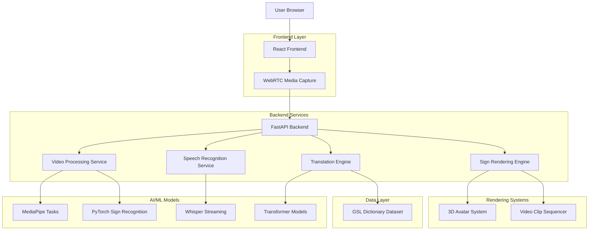
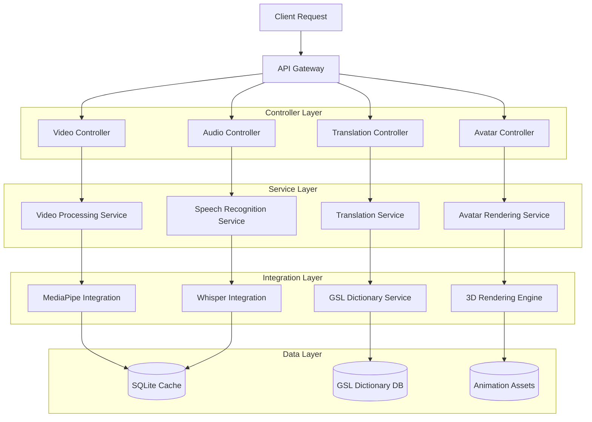
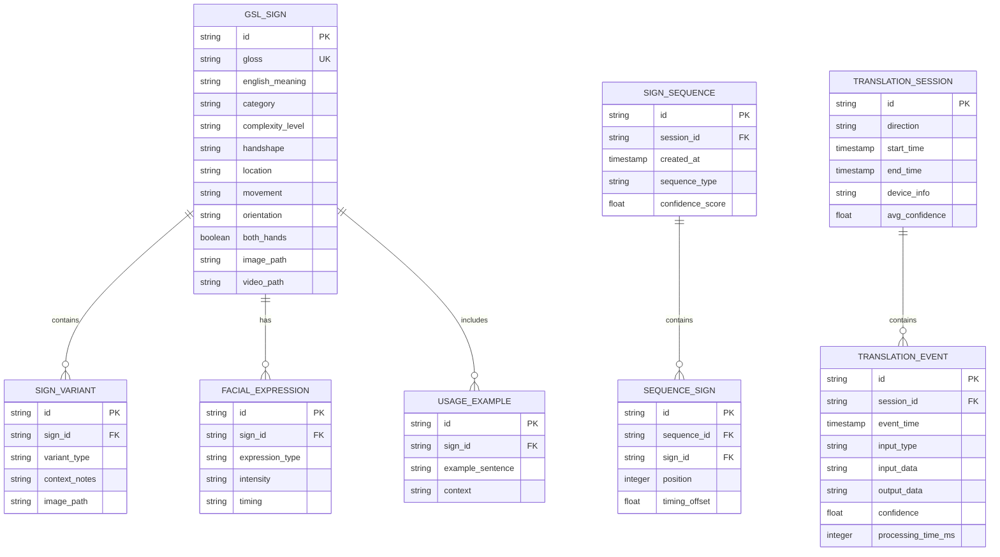

## 1. Architecture Design



## 2. Technology Description

- **Frontend**: React@18 + Vite + Tailwind CSS + WebRTC
- **Backend**: FastAPI + WebSockets + AsyncIO
- **AI/ML**: PyTorch@2.1 + MediaPipe@0.10 + Whisper@20231117 + Sentence Transformers
- **3D Rendering**: Three.js + @react-three/fiber + @react-three/drei
- **Data Storage**: SQLite + JSON + Local Storage
- **Initialization Tool**: vite-init

## 3. Route Definitions

| Route | Purpose |
|-------|---------|
| / | Home page with mode selection |
| /interpreter | Main translation interface |
| /settings | User preferences and accessibility |
| /help | Visual tutorials and troubleshooting |
| /api/video/stream | WebSocket endpoint for video processing |
| /api/audio/stream | WebSocket endpoint for audio processing |
| /api/translate/sign-to-speech | GSL to English translation |
| /api/translate/speech-to-sign | English to GSL translation |
| /api/avatar/render | 3D avatar animation data |
| /api/dictionary | GSL dictionary data access |

## 4. API Definitions

### 4.1 Video Processing API
```
WebSocket /api/video/stream
```

Incoming Message:
```json
{
  "type": "video_frame",
  "data": "base64_encoded_frame",
  "timestamp": 1234567890,
  "resolution": {"width": 640, "height": 480}
}
```

Outgoing Message:
```json
{
  "type": "pose_data",
  "landmarks": {
    "hands": [[x, y, z], ...],
    "pose": [[x, y, z], ...],
    "face": [[x, y, z], ...]
  },
  "confidence": 0.95,
  "timestamp": 1234567890
}
```

### 4.2 Translation API
```
POST /api/translate/sign-to-speech
```

Request:
```json
{
  "pose_sequence": [
    {"landmarks": {...}, "timestamp": 1234567890},
    {"landmarks": {...}, "timestamp": 1234567891}
  ],
  "context": "previous_glosses"
}
```

Response:
```json
{
  "gsl_glosses": ["HELLO", "HOW", "YOU"],
  "english_text": "Hello, how are you?",
  "confidence": 0.89,
  "processing_time_ms": 245
}
```

### 4.3 Avatar Rendering API
```
POST /api/avatar/render
```

Request:
```json
{
  "gsl_sequence": ["HELLO", "NAME", "WHAT"],
  "animation_mode": "3d_avatar",
  "speed": 1.0,
  "facial_expressions": true
}
```

Response:
```json
{
  "animation_data": {
    "keyframes": [...],
    "duration_ms": 2500,
    "blend_shapes": {...}
  },
  "video_clips": ["clip1.mp4", "clip2.mp4"],
  "transition_data": {...}
}
```

## 5. Server Architecture Diagram



## 6. Data Model

### 6.1 Data Model Definition


### 6.2 Data Definition Language

**GSL Signs Table**
```sql
CREATE TABLE gsl_signs (
  id VARCHAR(50) PRIMARY KEY,
  gloss VARCHAR(100) NOT NULL UNIQUE,
  english_meaning TEXT NOT NULL,
  category VARCHAR(50),
  complexity_level VARCHAR(20) CHECK (complexity_level IN ('basic', 'intermediate', 'advanced')),
  handshape VARCHAR(100),
  location VARCHAR(100),
  movement VARCHAR(200),
  orientation VARCHAR(50),
  both_hands BOOLEAN DEFAULT FALSE,
  image_path VARCHAR(500),
  video_path VARCHAR(500),
  created_at TIMESTAMP DEFAULT CURRENT_TIMESTAMP,
  updated_at TIMESTAMP DEFAULT CURRENT_TIMESTAMP
);

CREATE INDEX idx_gsl_signs_gloss ON gsl_signs(gloss);
CREATE INDEX idx_gsl_signs_category ON gsl_signs(category);
CREATE INDEX idx_gsl_signs_complexity ON gsl_signs(complexity_level);
```

**Translation Sessions Table**
```sql
CREATE TABLE translation_sessions (
  id VARCHAR(50) PRIMARY KEY,
  direction VARCHAR(20) CHECK (direction IN ('sign_to_speech', 'speech_to_sign')),
  start_time TIMESTAMP DEFAULT CURRENT_TIMESTAMP,
  end_time TIMESTAMP,
  device_info JSON,
  avg_confidence FLOAT,
  total_events INTEGER DEFAULT 0,
  created_at TIMESTAMP DEFAULT CURRENT_TIMESTAMP
);

CREATE INDEX idx_sessions_direction ON translation_sessions(direction);
CREATE INDEX idx_sessions_start_time ON translation_sessions(start_time);
```

**Translation Events Table**
```sql
CREATE TABLE translation_events (
  id VARCHAR(50) PRIMARY KEY,
  session_id VARCHAR(50) REFERENCES translation_sessions(id),
  event_time TIMESTAMP DEFAULT CURRENT_TIMESTAMP,
  input_type VARCHAR(50),
  input_data JSON,
  output_data JSON,
  confidence FLOAT CHECK (confidence >= 0 AND confidence <= 1),
  processing_time_ms INTEGER,
  error_message TEXT,
  created_at TIMESTAMP DEFAULT CURRENT_TIMESTAMP
);

CREATE INDEX idx_events_session_id ON translation_events(session_id);
CREATE INDEX idx_events_event_time ON translation_events(event_time);
```

**Sign Sequences Table**
```sql
CREATE TABLE sign_sequences (
  id VARCHAR(50) PRIMARY KEY,
  session_id VARCHAR(50) REFERENCES translation_sessions(id),
  sequence_type VARCHAR(50),
  created_at TIMESTAMP DEFAULT CURRENT_TIMESTAMP,
  confidence_score FLOAT,
  timing_data JSON
);

CREATE INDEX idx_sequences_session_id ON sign_sequences(session_id);
```